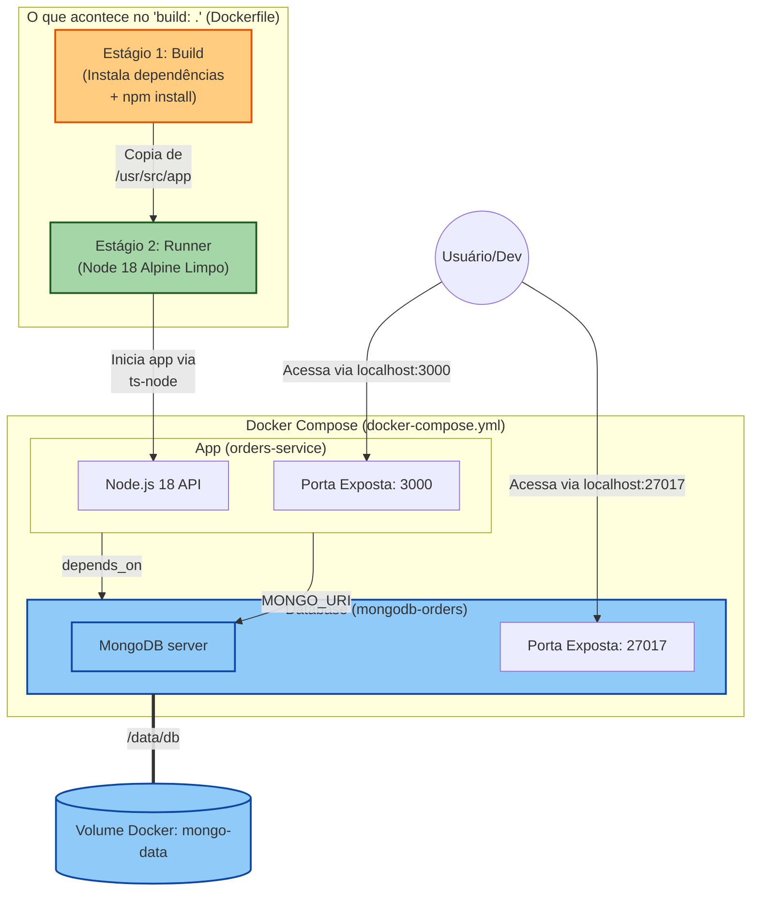

# Infográfico do Ecossistema Docker - Pedidos Node

O diagrama abaixo ilustra como os contêineres, volumes e processos internos interagem no projeto com base na documentação criada. 
Para melhor visualização, você pode usar uma extensão no VS Code que renderize Mermaid (como "Mermaid Preview") ou utilizar visualizadores no GitHub e Notion.

### 📋 Guia de Leitura do Infográfico:
1. **Orquestração (Caixa principal):** Representa o `docker-compose.yml`, que sobe a "App" e a "Database" juntas. Note a seta de `depends_on`, que mostra que o app só sobe depois que o banco inicia.
2. **Ciclo de Build (Debaixo do App):** Representa o nosso `Dockerfile` Multi-stage. Um contêiner temporário instala os pacotes (`Estágio 1`) e transfere só o necessário para a imagem limpa e leve de execução final (`Estágio 2`).
3. **Persistência de Dados:** O cilindro na parte inferior representa o volume `mongo-data`, que fica salvo no computador anfitrião para reter todas as informações geradas pelo MongoDB (em sua pasta interna `/data/db`) e não perder dados durante resets.
4. **Interação Externa:** O "Usuário" consegue se comunicar com a aplicação pelas portas abertas `3000` (API) e também inspecionar o banco em `27017`.
